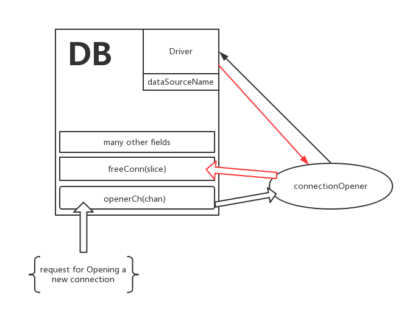

[理解golang io.Pipe](http://www.jianshu.com/p/aa207155ca7d)

[dive into golang database/sql 1](http://www.jianshu.com/p/3b0b3a4c83da)
[dive into golang database/sql 2](http://www.jianshu.com/p/807257fcb985)
[dive into golang database/sql 3](http://www.jianshu.com/p/cd8cee3d7fc3)

数据库操作是一个应用必不可少的部分，但是我们很多时候对golang的sql包仅仅是会用，这是不够的。每一条语句的执行，它的背后到底发生了什么。各式各样对sql包的封装，是不是有必要的，有没有做无用功？

这是go to database package系列文章的第一篇。本系列将按照程序中使用sql包的顺序来展开

先来看一段简短的代码：
```go
package main
import (
    "database/sql"
    _ "github.com/go-sql-driver/mysql"
    "fmt"
)

func main() {
    db, err := sql.Open("mysql", "user:password@/dbname")
    if nil != err {
        panic(err)
    }
    age := 18
    rows,err := db.Query(`SELECT name,age FROM person where age > ?`, age)
    if nil != err {
        panic(err)
    }
    defer rows.Close()
    for rows.Next() {
        var name string
        var age int
        err := rows.Scan(&name, &age)
        if nil != err {
            panic(err)
        }
        fmt.Println(name, age)
    }
}
```

这应该是最简单的使用场景了。本文也会按照以上代码，逐句展开。

import _ "somedriver"是在干什么

先来看一下golang官方文档的说法：

To import a package solely for its side-effects (initialization), use the blank identifier as explicit package name:

```go
import _ "lib/math"
```

也就是说，import _ "somedriver" 仅仅是想调用somedriver包的init方法。那么我们可以一起来看看go-sql-driver/mysql的init方法。它非常简单：

```go
func init() {
    sql.Register("mysql", &MySQLDriver{})
}
```

只有1行，确实非常的简单。调用sql的Register方法注册了一个名为mysql的数据库驱动，而驱动本身就是&MySQLDriver{}。

那我们再看看sql包中的Register方法：

```go
// Register makes a database driver available by the provided name.
// If Register is called twice with the same name or if driver is nil,
// it panics.
func Register(name string, driver driver.Driver) {
    driversMu.Lock()
    defer driversMu.Unlock()
    if driver == nil {
        panic("sql: Register driver is nil")
    }
    if _, dup := drivers[name]; dup {
        panic("sql: Register called twice for driver " + name)
    }
    drivers[name] = driver
}
```
Register的第二个参数接收一个driver.Driver的interface，因此go-sql-driver/mysql包中的`&MySQLDriver`必须实现driver.Driver规定的一系列方法（当然它肯定实现了）。

Register函数如果发现名为name的driver已经注册了，就会触发panic，否则就进行注册。注册其实很简单，drivers[name] = driver。

drivers是一个map

```go
drivers   = make(map[string]driver.Driver)
```

所以简单来说，import _ "somedriver"其实就是调用sql.Register注册一个实现了driver.Driver接口的实例。

驱动给sql包提供了最基本的支持，sql包最终与数据库打交道的操作都是通过driver完成的。其实不应该说sql包，而应该说是DB实例。

在上面程序main函数的一开始，执行sql.Open拿到了一个DB实例，那么什么是DB实例，sql.Open又干了什么？

sql.Open是在干什么

看一下官方文档的介绍：

```
func Open(driverName, dataSourceName string) (*DB, error)
//Open opens a database specified by its database driver name and a driver-specific data source name, usually consisting of at least a database name and connection information.

//Most users will open a database via a driver-specific connection helper function that returns a *DB. No database drivers are included in the Go standard library. See https://golang.org/s/sqldrivers for a list of third-party drivers.

//Open may just validate its arguments without creating a connection to the database. To verify that the data source name is valid, call Ping.

//The returned DB is safe for concurrent use by multiple goroutines and maintains its own pool of idle connections. Thus, the Open function should be called just once. It is rarely necessary to close a DB.
```

简单来说，Open返回一个DB实例，DB实例引用了由driverName指定的数据库驱动程序。DB本身维护了数据库连接池，是线程安全的。

```go
func Open(driverName, dataSourceName string) (*DB, error) {
    driversMu.RLock()
    driveri, ok := drivers[driverName]
    driversMu.RUnlock()
    if !ok {
        return nil, fmt.Errorf("sql: unknown driver %q (forgotten import?)", driverName)
    }
    db := &DB{
        driver:   driveri,
        dsn:      dataSourceName,
        openerCh: make(chan struct{}, connectionRequestQueueSize),
        lastPut:  make(map[*driverConn]string),
    }
    go db.connectionOpener()
    return db, nil
}
```
Open方法：

- 根据driverName拿到对应的driver
- 根据driver和dataSourceName生成一个DB实例
- 另起一个goroutine来执行某种任务A

如果对goroutine比较敏感的同学可能会猜到go db.connectionOpener()是在干嘛。在go中大多数情况下新开一个goroutine都是在：

- 监听某个channel
- 往某个channel发消息

根据上面的代码不难猜测，connectionOpener和opennerCh有关。看名字也很容易看出，connectionOpener翻译过来就是连接创建者，负责创建连接。看看代码吧：

```go
// Runs in a separate goroutine, opens new connections when requested.
func (db *DB) connectionOpener() {
    for range db.openerCh {
        db.openNewConnection()
    }
}
```

每当从openerCh取到一条消息，connectionOpener就创建一个连接。

如何创建连接其实很简单，就是调用Driver提供的Open方法，具体先暂时不展开了。(不展开的这个决定，和golang的sql包是很吻合的，因为sql包对Open一个连接的处理，仅仅是定义了一个接口，让驱动去实现。也就是说，在逻辑上这里需要Open一个新连接，具体怎么做我不管，Driver你提供Open接口，返回给我我要的就行。)

整个DB可以画一张图来理解。



当然DB实例还有很多其它细节，但是对于sql.Open方法来说，以上就够了。总结一下，sql.Open会根据driverName和dataSourceName生成一个DB实例，并且另起一个goroutine来负责新建连接（监听openerCh的“新建连接请求”）。

在这里可以看出，执行sql.Open，仅仅返回了DB实例，但无法得知是否真的和数据库成功连接。按照文档的说法，如果要确认是否和数据库真的连接上了，需要执行Ping方法：

Open may just validate its arguments without creating a connection to the database. To verify that the data source name is valid, call Ping.

成功拿到DB对象之后，我们就可以操作数据库了。


本章我们将更加全面更加深入地介绍DB对象，学习它是如何创建连接并维护连接池的

### 从db.Query说起

继续那段最常见的代码：

```go
db,_ := sql.Open("mysql", "xxx")
rows,_ := db.Query("SELECT age,name from student where score > ?", 85)
defer rows.Close()
for rows.Next() {
    var age int
    var name string
    _ = rows.Scan(&age, &name)
    fmt.Println(age, name)
}
```
上面的代码为了简便我忽略的所有的错误处理，但实际项目中你必须处理任何的错误！

当我们拿到db对象之后就可以进行Query了，那么Query背后到底发生了什么呢？源码非常简单，就只有几行：

```go
// Query executes a query that returns rows, typically a SELECT.
// The args are for any placeholder parameters in the query.
func (db *DB) Query(query string, args ...interface{}) (*Rows, error) {
    var rows *Rows
    var err error
    for i := 0; i < maxBadConnRetries; i++ {
        rows, err = db.query(query, args, cachedOrNewConn)
        if err != driver.ErrBadConn {
            break
        }
    }
    if err == driver.ErrBadConn {
        return db.query(query, args, alwaysNewConn)
    }
    return rows, err
}
```
其实这个Query方法只是做了一层简单的包装，仅从这里我们依然看不出具体的行为，但是我们能够了解到的是，如果错误是driver.ErrBadConn的话，sql包默认帮我们做了maxBadConnRetries次重试。
```go
// maxBadConnRetries is the number of maximum retries if the driver returns
// driver.ErrBadConn to signal a broken connection before forcing a new
// connection to be opened.
const maxBadConnRetries = 2
```
那我们再继续深入看看db.query方法究竟做了哪些工作：
```go
func (db *DB) query(query string, args []interface{}, strategy connReuseStrategy) (*Rows, error) {
    ci, err := db.conn(strategy)
    if err != nil {
        return nil, err
    }

    return db.queryConn(ci, ci.releaseConn, query, args)
}
````
当然，细节也不明显。不过不用急，一步一步来。可以发现db.query做了两件事情：

- 根据某种策略(strategy)获取一个数据库连接
- 基于这个连接进行query操作

其实，所有的数据库操作都是这样：

- 先获取数据库连接
- 基于此连接执行目标指令

接下来，我们将重点看看获取数据库连接这部分的实现。

### 获取数据库连接

获取数据库连接的db.conn方法稍微有点长（60行左右），这里我给一个简略的伪代码版本：

```go
func (db *DB) conn(strategy xxx) (*driverConn, error) {
    lock()
    defer unlock()
    if strategy==cachedOrNewConn && anyFreeConnCanReuse(db.freeConn) {
        conn := getOneConnFrom(db.freeConn)
        maintain(db.freeConn)
        return conn,nil
    }
    if db.maxOpen > 0 && db.numOpen >= db.maxOpen {
        db.connRequests = append(db.connRequests, dontReleaseConnToFreeConnGiveIt2MeInstead)
        ret := <- dontReleaseConnToFreeConnGiveIt2MeInstead
        return ret.conn,nil
    }
    conn := openANewConn(db.driver)
    maintainSomeInfo()
    return conn,nil
}
```

从伪代码里可以看出，获取一个数据库连接分三种情况：

- 如果获取策略是cachedOrNewConn，就从现有的连接池里取一个空闲连接
- 如果连接池里无可用连接，而连接数又已经到达配置的上限值，就发送一个坐等连接的通知，然后阻塞地在这里等等待（其它地方释放连接时会优先处理坐等连接的通知请求）
- 如果连接池无可用连接，而现有连接数还没有达到配置的最大值，就通过driver再新建一个连接。

上面db.freeConn其实就是一个`[]*driverConn`，里面存放了空闲的数据库连接。

比较有意思的是第二点中的坐等连接，怎么个坐等法呢？看看实际代码就明白了：

```go
if db.maxOpen > 0 && db.numOpen >= db.maxOpen {
        // Make the connRequest channel. It's buffered so that the
        // connectionOpener doesn't block while waiting for the req to be read.
        req := make(chan connRequest, 1)
        db.connRequests = append(db.connRequests, req)
        db.mu.Unlock()
        ret, ok := <-req
        if !ok {
            return nil, errDBClosed
        }
        if ret.err == nil && ret.conn.expired(lifetime) {
            ret.conn.Close()
            return nil, driver.ErrBadConn
        }
        return ret.conn, ret.err
    }
```
    
先看看connRequest的定义：
```go
// connRequest represents one request for a new connection
// When there are no idle connections available, DB.conn will create
// a new connRequest and put it on the db.connRequests list.
type connRequest struct {
    conn *driverConn
    err  error
}
```
而db.connRequests其实就是`[]chan connRequest`

所以坐等连接其实就是，把一个connRequest放入db.connRequests中，等待它被填充。当它被填充过了，于是我们就可以从它里面拿到数据库连接了。

“喂！db大哥！现在新建不了连接了，但是我急着要，你那儿有了空闲的就赶紧帮我放到connRequest里面，我在这儿等着呢”

那么到底是什么时候db会去填充这个connRequest？猜猜看？

很容易想到，是在释放连接的时候。每当一个连接使用完毕想要释放时，通常会想到将它放入freeConn队列中。这时，可以先检测connRequests中有没有坐等连接的请求，有的话就可以把连接分给那个请求，而不是放进freeConn。这也符合freeConn的定义，既然有任务等着用连接，显然freeConn里是不应该有连接的。但到底是不是这样的呢？一起看看代码：

```go
// Satisfy a connRequest or put the driverConn in the idle pool and return true
// or return false.
// putConnDBLocked will satisfy a connRequest if there is one, or it will
// return the *driverConn to the freeConn list if err == nil and the idle
// connection limit will not be exceeded.
// If err != nil, the value of dc is ignored.
// If err == nil, then dc must not equal nil.
// If a connRequest was fulfilled or the *driverConn was placed in the
// freeConn list, then true is returned, otherwise false is returned.
func (db *DB) putConnDBLocked(dc *driverConn, err error) bool {
    if db.closed {
        return false
    }
    if db.maxOpen > 0 && db.numOpen > db.maxOpen {
        return false
    }
    if c := len(db.connRequests); c > 0 {
        req := db.connRequests[0]
        // This copy is O(n) but in practice faster than a linked list.
        // TODO: consider compacting it down less often and
        // moving the base instead?
        copy(db.connRequests, db.connRequests[1:])
        db.connRequests = db.connRequests[:c-1]
        if err == nil {
            dc.inUse = true
        }
        req <- connRequest{
            conn: dc,
            err:  err,
        }
        return true
    } else if err == nil && !db.closed && db.maxIdleConnsLocked() > len(db.freeConn) {
        db.freeConn = append(db.freeConn, dc)
        db.startCleanerLocked()
        return true
    }
    return false
}
```
首先解释一下方法名putConnDBLocked。在sql包中，如果某个方法当且仅当会在加锁的情况下被调用，那么就会给这个方法加上Locked的后缀，方便开发者理解。

在putConnDBLocked方法中，首先会去检测db.connRequests里是否有坐等连接的请求，如果有的话就用当前要释放的连接去满足那个请求。只有当发现没有请求时，才会把连接放到freeConn中。

这有一个问题：

为什么不把所有的连接全部释放到一个channel里，任何需要连接的都通过 `conn <- bufferedChan` 这样的方式统一来处理，而要选择用freeConn和connRequests两个slice来曲折地实现呢？
我觉得作者主要考虑的问题是公平性。如果多个goroutine同时在取某个channel，那么当channel中新加一条消息时，无法确定这条消息被谁取走了，大家的机会都是均等的。在极端情况下，这可能出现某个等着获取连接的请求永远取不到连接。

使用connRequest对请求进行排队，这样可以让先等待的一方在有连接可用时可以先用上。但是对于每次取队首元素的场景，代码实现为什么会选择用slice而不是链表？
```go
req := db.connRequests[0]
// This copy is O(n) but in practice faster than a linked list.
copy(db.connRequests, db.connRequests[1:])
db.connRequests = db.connRequests[:c-1]
```
代码中有注释说：

虽然copy是O(n)的复杂度，但是实际情况是比链表更快。
copy具体的实现由于在汇编代码里所以暂时没有看，如果真的是不输于链表的话，我猜测copy(s1, s2)执行的其实类似于
```
s1.Head = s2.Head
```
如果是这样的话，那copy确实性能很好。

后续我会专门写一篇文章来分析builtin copy。

当获取到数据库连接之后，就可以基于这个连接进行真实的数据库操作了。

### db.Query()
实际上分为两步：

- 获取数据库连接
- 在此连接上利用driver进行实际的DB操作

```go
func (db *DB) query(query string, args []interface{}, strategy connReuseStrategy) (*Rows, error) {
    ci, err := db.conn(strategy)
    if err != nil {
        return nil, err
    }

    return db.queryConn(ci, ci.releaseConn, query, args)
}
```
那我们就一起来看看db.queryConn

其实sql包最核心的就是维护了连接池，对于实际的操作，都是利用Driver去完成。因此代码实现也一样，坚持一个原则：

组装Driver需要的参数，执行Driver的方法
db.queryConn伪代码如下：
```go
func (db *DB) queryConn(dc *driverConn, releaseConn func(error), query string, args []interface{}) (*Rows, error) {
    if queryer, ok := dc.ci.(driver.Queryer); ok {
        dargs, err := driverArgs(nil, args)
        if err != nil {
            releaseConn(err)
            return nil, err
        }
        dc.Lock()
        rowsi, err := queryer.Query(query, dargs)
        dc.Unlock()
        if err != driver.ErrSkip {
            if err != nil {
                releaseConn(err)
                return nil, err
            }
            // Note: ownership of dc passes to the *Rows, to be freed
            // with releaseConn.
            rows := &Rows{
                dc:          dc,
                releaseConn: releaseConn,
                rowsi:       rowsi,
            }
            return rows, nil
        }
    }

    dc.Lock()
    si, err := dc.ci.Prepare(query)
    dc.Unlock()
    if err != nil {
        releaseConn(err)
        return nil, err
    }

    ds := driverStmt{dc, si}
    rowsi, err := rowsiFromStatement(ds, args...)
    if err != nil {
        dc.Lock()
        si.Close()
        dc.Unlock()
        releaseConn(err)
        return nil, err
    }

    // Note: ownership of ci passes to the *Rows, to be freed
    // with releaseConn.
    rows := &Rows{
        dc:          dc,
        releaseConn: releaseConn,
        rowsi:       rowsi,
        closeStmt:   si,
    }
    return rows, nil
}
```
queryConn的实现可以分为两部分来看：

- Driver实现了Queryer接口
- Driver没有实现该接口，走Stmt三部曲

### Queryer

Queryer接口很能体现golang内部命名interface的风格，比如Reader、Writer等，Queryer要求实现一个Query方法。如果Driver实现了这个Query方法，那么sql包只需要把它需要的参数准备好然后传给它就行了。

driverArgs用来准备Query需要的参数，实际上就是把各种类型的值利用反射转换成它所在类型的最大类型。这句话有点不好理解，简单点讲就是把`int int8 uint uint16 int16`等转换为int64，把floatX转换为float64。最终，driverArgs会把所有类型转化为以下几种

```
  []byte
  bool
  float64
  int64
  string
  time.Time
```

准备好参数之后就调用Driver实现好的Query方法。
```go
dc.Lock()
rowsi, err := queryer.Query(query, dargs)
dc.Unlock()
```
最终的请求很简单，因为工作量都在driver

每个Query都会先获取连接再进行Query，如果连接池是线程安全的，对于取到连接的后续行为还需要加锁吗？

调用Driver的Query方法执行完Query请求就拿到了rowsi（Driver.Rows），将它包一层包成sql.Rows返回给caller。
```go
// Note: ownership of dc passes to the *Rows, to be freed
// with releaseConn.
rows := &Rows{
    dc:          dc,
    releaseConn: releaseConn,
    rowsi:       rowsi,
}
return rows, nil
```

至此呢，一个真实的请求就处理完毕了。实际上对于sql包来说非常简单，工作量都在各种不同的Driver里。

### Stmt

正如文档所说，Queryer接口是可选的：
```
Queryer is an optional interface that may be implemented by a Conn.

If a Conn does not implement Queryer, the sql package's DB.Query will first prepare a query, execute the statement, and then close the statement.
```

所以对于那些偷懒的Driver来说，执行一个Query请求就得用Stmt了。

```go
dc.Lock()
si, err := dc.ci.Prepare(query)
dc.Unlock()
```

Prepare方法产生一个Stmt。当然这里同样有相同的问题需要你思考一下，这里加锁是否有必要。可以先看看Stmt的定义：

```go
// Stmt is a prepared statement. It is bound to a Conn and not
// used by multiple goroutines concurrently.
type Stmt interface {
    // Close closes the statement.
    //
    // As of Go 1.1, a Stmt will not be closed if it's in use
    // by any queries.
    Close() error

    // NumInput returns the number of placeholder parameters.
    //
    // If NumInput returns >= 0, the sql package will sanity check
    // argument counts from callers and return errors to the caller
    // before the statement's Exec or Query methods are called.
    //
    // NumInput may also return -1, if the driver doesn't know
    // its number of placeholders. In that case, the sql package
    // will not sanity check Exec or Query argument counts.
    NumInput() int

    // Exec executes a query that doesn't return rows, such
    // as an INSERT or UPDATE.
    Exec(args []Value) (Result, error)

    // Query executes a query that may return rows, such as a
    // SELECT.
    Query(args []Value) (Rows, error)
}
```

可以看到Stmt的方法也很简单，Exec和Query是最终执行请求会需要用到的方法。NumInput用来统计sql语句中占位符的数量。

很多人之前可能都比较疑惑Stmt是用来干什么的，看到这里应该明白了。事实上Stmt就是一个sql语句的模板，模板固定，只是参数在变化，这种场景就特别适合用Stmt，你不再需要把sql语句复制几遍。

拿到Stmt之后，通过执行Stmt的Query方法，也能拿到结果rows。进行Query之前也需要buildParams以及检查参数和sql语句的placeholder是否匹配等，所以进行了一个简单封装：

```
ds := driverStmt{dc, si}
rowsi, err := rowsiFromStatement(ds, args...)
```

si就是Stmt了为什么还要包成driverStmt，而driverStmt又是什么呢？其实主要还是为了在rowsiFromStatement方法中执行Query是加锁。参照Queryer中的代码，执行Query时是需要加锁的，这把锁是dc提供的，所以包装一个driverStmt变相让Stmt有了加锁的方法：

```go
// driverStmt associates a driver.Stmt with the
// *driverConn from which it came, so the driverConn's lock can be
// held during calls.
type driverStmt struct {
    sync.Locker // the *driverConn
    si          driver.Stmt
}
```
rowsiFromStatement内部执行完Query后也拿到了Driver.Rows，如之前一样包装成sql.Rows返回给caller就好。

至此，我们已经一起探究了golang的sql包是如何处理Query请求的了。但是还是有一个问题一直贯穿着整个过程，就是：

**为什么要加锁?**

如果只是看Query方法可以还不好理解，但是看了Stmt之后应该就可以理解了。Stmt是可以多次利用的，每个Stmt包含了conn，可以把一个Stmt看成一个数据库连接。有了数据库连接的概念，用户如果在多个goroutine中使用这个Stmt，就会有并发的问题，因此通过Stmt进行Query或者Exec是需要加锁的。

但是对于实现了Queryer接口的Driver来说，用户调用db.Query后每次都会取新的连接然后再进行Query，最后返回一个Rows。对用户来说直接Query的整个过程并没有连接的概念，因此我个人觉得是安全的。这里需不需要加锁有待商榷。如果觉得需要加锁欢迎留言和我讨论

### Tx

Tx实际上和上面是一样的，主要也是创建时先请求一个conn，然后基于这个conn包装一个Tx对象。后续的操作都要依赖于底层的数据库。

Tx需要特别注意的是:

**如果后端的数据库proxy，就不能使用数据库事务**
这和golang无关，所有语言都一样。因为我们无法保证我们对一个事务的请求都落到同一台机器。

关于golang的sql包，到这儿也将告一段落了。其实它的核心就是：

- 维护了数据库连接池
- 定义了一系列接口规范，让Driver可以面向接口进行开发

接下来有时间的话，我写一篇文章来分析go-sql-driver/mysql，不过底层的实现相对而言会比较无聊，主要都是实现mysql通信协议的规范，按照规范收发报文。

golang1.8 sql包中新增了不少接口，这很令人期待，更简化了我们对于数据库的使用，方便进行一些高级的封装，而不用层层反射。不过目前各Driver的支持是一个大问题。
