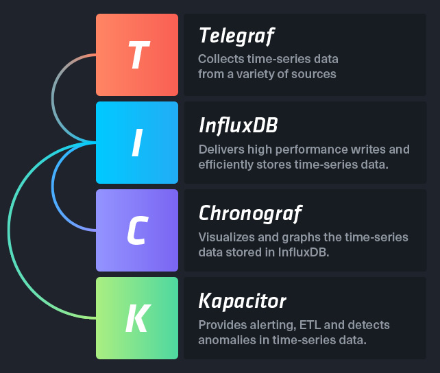
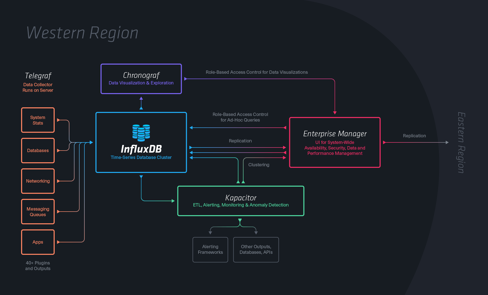

influxdb
========

也可以参考[如何在Ubuntu 16.04上使用TICK监视系统指标](https://www.howtoing.com/how-to-monitor-system-metrics-with-the-tick-stack-on-ubuntu-16-04/)  
[使用influxdb有感](https://github.com/vicanso/articles/blob/master/best-statistics.md)    
[InfluxDB使用笔记](https://anyof.me/articles/390)  
[Kubernetes监控之InfluxDB](http://dockone.io/article/1878)  
[Grafana3.1.0的使用](http://blog.csdn.net/tony_bo/article/details/54095616)  


#### 在ubuntu16.04上安装influxdb

```shell
wget https://dl.influxdata.com/influxdb/releases/influxdb_1.2.2_amd64.deb
sudo dpkg -i influxdb_1.2.2_amd64.deb
# 这个要在ubuntu16.04上没有安装过 ubuntu自已源里的 influxdb 才会成功. 不然会报错
```

安装好后, 可以直接用

```shell
sudo service influxdb start     # 启动
sudo service influxdb stop      # 停止
sudo service influxdb restart   # 重启
sudo service influxdb status    # 查看状态
```

`/usr/bin/influxd -config /etc/influxdb/influxdb.conf`
这是服务启动时真实去执行的命令. 可以看到配置文件使用的是 `/etc/influxdb/influxdb.conf`
服务执行的真实脚本在  `/lib/systemd/system/influxdb.service`
因为ubuntu16.04已转用 systemd [来对系统服务提供管理和控制](ubuntu_16_04_service_基础要点.md)

#### 常用命令

启动InfluxDB控制台

```shell
influx   

influx -precision rfc3339   #　指定日期的使用rfc3339 格式(YYYY-MM-DDTHH:MM:SS.nnnnnnnnnZ)
```

创建的用户有: wjz/wjz  wjzadmin/wjz (有管理权限)

使用密码sammy_admin创建一个sammy用户

```shell
CREATE USER "sammy" WITH PASSWORD 'sammy_admin' WITH ALL PRIVILEGES
```

查看用户列表

```shell
show users
```

**查看日志**

```
$  journalctl -u influxdb > influxd.log

过滤出持续查询
journalctl -u influxdb | grep continuous_querier > cq.log

```

每30分钟检查一次  retention policy (RP) 

`"<database>"."<retention_policy>"."<measurement>"`  一个表的完整命名

展示数据库表的所有字段的类型 (https://docs.influxdata.com/influxdb/v1.2/troubleshooting/frequently-asked-questions/#how-does-influxdb-handle-field-type-discrepancies-across-shards)
`SHOW FIELD KEYS` returns every data type, across every shard, associated with the field key.
`show field keys from 表名`  查看单表的data type

`SHOW SHARDS`  查看shard(数据存储的地方) https://docs.influxdata.com/influxdb/v1.2/concepts/glossary/#shard

```
SELECT MEAN("dogs" - "cats") from "pet_daycare"
```
这种不支持, 要改为子查询
```
SELECT MEAN("difference") FROM (SELECT "dogs" - "cat" AS "difference" FROM "pet_daycare")
```


The following query calculates the average value of sunflowers between 6:15pm and 7:45pm and groups those averages into one hour intervals:

```
SELECT mean("sunflowers")
FROM "flower_orders"
WHERE time >= '2016-08-29T18:15:00Z' AND time <= '2016-08-29T19:45:00Z' GROUP BY time(1h)
```
得到的结果
```
name: flower_orders
-------------------
time                  mean
2016-08-29T18:00:00Z  22.332
2016-08-29T19:00:00Z  62.75
```

**Offset interval**

```
SELECT mean("sunflowers")
FROM "flower_orders"
WHERE time >= '2016-08-29T18:15:00Z' AND time <= '2016-08-29T19:45:00Z' GROUP BY time(1h,15m)
                                                                                         ---
                                                                                          |
                                                                                   offset interval
```
得到的结果
```
-------------------
time                  mean
2016-08-29T18:15:00Z  30.75
2016-08-29T19:15:00Z  65

```

*group by time() 有时间范围的限制*

In the following codeblock, the first query covers data with timestamps between `2015-09-18T21:30:00Z` and `now()`. 
The second query covers data with timestamps between `2015-09-18T21:30:00Z` and `180 weeks` from `now()`.
```
> SELECT MEAN("boards") FROM "hillvalley" WHERE time >= '2015-09-18T21:30:00Z' GROUP BY time(12m) fill(none)
> SELECT MEAN("boards") FROM "hillvalley" WHERE time >= '2015-09-18T21:30:00Z' AND time <= now() + 180w GROUP BY time(12m) fill(none)
```

从查询结果中排除空字段
InfluxQL 支持 fill(<fill_options>)，这一函数会把空值按照 fill_options 进行替换。其中一个选项就是 none；fill(none) 在一个没有数据的时间段里既不会返回 Timestamp 也不会返回值。
也就是使用上面的 group by time(12m) fill(none)


查询转换字段的类型

```
SELECT <field_key>::<type> [...] returns all value types.
```
例子
```
SELECT "my_field"::float,"my_field"::integer,"my_field"::string,"my_field"::boolean FROM just_my_type

name: just_my_type
------------------
time			               my_field	 my_field_1	 my_field_2		 my_field_3
2016-06-03T15:45:00Z	 9.87034	  9
2016-06-03T16:45:00Z	 7	        7
2016-06-03T17:45:00Z			                     a string
2016-06-03T18:45:00Z					                                true
```


当前influxQL不支持 `or` 条件, 如果有出现 `or` 则返回空记录集

field 要一条记录里一定要出现, tag可以不出现. select 里面一定要包含一个field, 不能全是tag. field要一般参与count, mean之类的运算. tag用于where跟group by 
 


#### 在ubuntu16.04上安装Telgraf

数据收集工具

```shell
wget https://dl.influxdata.com/telegraf/releases/telegraf_1.2.1_amd64.deb
sudo dpkg -i telegraf_1.2.1_amd64.deb
```

Created symlink from `/etc/systemd/system/multi-user.target.wants/telegraf.service` to `/lib/systemd/system/telegraf.service`

```shell
sudo systemctl restart telegraf

sudo service telegraf start

/usr/bin/telegraf -config /etc/telegraf/telegraf.conf -config-directory /etc/telegraf/telegraf.d
```

#### 在ubuntu16.04上安装chronograf

数据展示 画图

```shell
wget https://dl.influxdata.com/chronograf/releases/chronograf_1.2.0~beta7_amd64.deb
sudo dpkg -i chronograf_1.2.0~beta7_amd64.deb
```


#### 在ubuntu16.04安装Kapacitor

处理influxdb里的数据工具, 可定义脚本定时执行统计,触发报警

```shell
wget https://dl.influxdata.com/kapacitor/releases/kapacitor_1.2.0_amd64.deb
sudo dpkg -i kapacitor_1.2.0_amd64.deb
```

Created symlink from /etc/systemd/system/kapacitor.service to /lib/systemd/system/kapacitor.service.
Created symlink from /etc/systemd/system/multi-user.target.wants/kapacitor.service to /lib/systemd/system/kapacitor.service.

```shell
sudo service kapacitor start

/usr/bin/kapacitord -config /etc/kapacitor/kapacitor.conf
```

#### 在ubuntu16.04安装Grafana

数据展示 画图. 面板展示

```shell
wget https://s3-us-west-2.amazonaws.com/grafana-releases/release/grafana_4.2.0_amd64.deb
sudo apt-get install -y adduser libfontconfig
sudo dpkg -i grafana_4.2.0_amd64.deb
```

```
sudo /bin/systemctl daemon-reload
sudo /bin/systemctl enable grafana-server

sudo /bin/systemctl start grafana-server  # 启动

### NOT starting on installation, please execute the following statements to configure grafana to start automatically using systemd 
 sudo /bin/systemctl daemon-reload
 sudo /bin/systemctl enable grafana-server
### You can start grafana-server by executing
 sudo /bin/systemctl start grafana-server

```

脚本文件在 
```
/etc/systemd/system/multi-user.target.wants/grafana-server.service 
/usr/lib/systemd/system/grafana-server.service
```

实际运行命令:
/usr/sbin/grafana-server --config=/etc/grafan/grafana.ini --pidfile= cfg:default.paths.logs=/var/log/grafana cfg:default.paths.data=/var/lib/grafana cfg:default.paths.plugins=/var/lib/grafana/plugins


### 名词

**InfluxDB 中 tag_set 和 field_set 的选择**

对于tag_set和field_set应该怎么选择，这个我讲一下个人见解。一般来讲tag_set可以认为是一种分类，在同一个measurement中，这些point能怎么分类，统计展示时，希望怎样的分组，
那么就应该选择保存为tag。field对于这个point，它是比较特别的一个数据，并不是说一定和其它的point就一定无关，但是它的关联性没有那么大，而且一般来说，它的可取值范围都是比较大的

**GROUP BY**

值得一提的是，作为时序数据库，InfluxDB在查询上有一些时间相关的操作，例如 GROUP BY 操作可以按照时间戳进行聚合，获得每个时间片级别上的聚合数据。即通过 GROUP BY time(interval) 方法进行聚合，interval 即支持的时间片，支持的范围有：


| 时间片单位 | 范围 |
|:---------|:-----|
| u        | 微秒 |
| ms       | 毫秒 |
| s        | 秒   |
| m        | 分钟 |
| h        | 小时 |
| d        | 天   |
| w        | 周   |

比如 time(3d) 表示按照3天作为周期进行聚合。

同时 `fill()` 方法也是一个有意思的功能，使用 `GROUP BY` 之后，如果某个聚合的结果内没有值，可以通过 `fill()` 设定为自己需要的值。

**into**

把查询的结果集做为另一张表

```sql
SELECT MEAN("water_level") INTO "average" FROM "h2o_feet" 
WHERE "location" = 'santa_monica' 
  AND time >= '2015-08-18T00:00:00Z' 
  AND time <= '2015-08-18T00:30:00Z' 
GROUP BY time(12m)
```
 
 
即在2015-08-18T00:00:00Z到2015-08-18T00:30:00Z的时间范围内，将每12分钟在santa_monica区域的水位的平均值存入average表中。


**LIMIT & SLIMIT**

LIMIT 限制的是数据的行数，而 SLIMIT 限制的则是返回的 Series 的个数，如果二者都要限制，则先设定 LIMIT，之后再设定 SLIMIT。

**OFFSET & SOFFSET**

分页是查询数据的一个基本方式，InfluxQL中通过 OFFSET 以及 SOFFSET 进行。  
类似 LIMIT & SLIMIT， OFFSET 是针对数据行的翻页，SOFFSET 是针对 Series 的翻页。

**时序相关**

时序数据库，自然查询的数据经常会与时间有关。前面提及的时间单位，在选定时间范围时，可以通过组合简化时间区间的确定。  
例如选出当前时间前3天到5小时前的数据，那么只需要指定条件为time >= now() - 3d AND time < now() - 5h即可。  
如果你愿意，也可以与 RFC3339 格式(如 `2007-05-01T15:43:26.3452-07:00` 或 `2015-08-18T00:00:00Z`)的时间做对比。  


我们有一个数据库名为testDB，里面有一张表weather用于记录：多个地区在几组海拔下的一天的温度变化，所以表中有以下字段：

- 时间 time  
- 温度 temperature  
- 湿度 humidity  
- 地区 area  
- 海拔 altitude


| influxDB中的名词 | 传统数据库中的概念 |
|:----------------|:----------------|
| database        | 数据库           |
| measurement     | 数据库中的表      |
| 数据库中的表      | 表里面的一行数据　 |
	
	
Point由时间戳（time）、数据（field）、标签（tags）组成。
point是在一个series中有相同时间戳的field set，也可以理解如表里的一行数据

| Point属性 | 传统数据库中的概念                                 |
|:---------|:------------------------------------------------|
| time     | 每个数据记录时间，是数据库中的主索引(会自动生成)       |
| fields   | 各种记录值（没有索引的属性）也就是记录的值：温度， 湿度  |
| tags     | 各种有索引的属性：地区(area)，海拔(altitude)        |


**series**
在同一个database中，series由retention policy、measurement、tag sets三部分组成
同一个Series的数据在物理上会按照时间顺序排列存储在一起。
Series的key为measurement + 所有tags的序列化字符串。


所有在数据库中的数据，都需要通过图表来展示，而这个series表示这个表里面的数据，可以在图表上画成几条线：**通过tags排列组合算出来**

比如有如下数据：

```
> select * from weather
name: weather
-------------
time                    altitude        area    humidity        temperature
1456386985094000000     1000            北      18              17
1456386985094000000     5000            上      20              47
1456386985094000000     5000            北      26              68
1456386985094000000     1000            广      17              83
1456387267668000000     1000            上      12              77
1456387267668000000     1000            北      16              20
1456387267668000000     5000            广      -3              66
1456387267668000000     5000            上      19              60
```

它的series为：

```
> show series from weather
name: weather
-------------
_key                            altitude        area
weather,altitude=1000,area=北   1000            北
weather,altitude=5000,area=北   5000            北
weather,altitude=5000,area=上   5000            上
weather,altitude=1000,area=广   1000            广
weather,altitude=1000,area=上   1000            上
weather,altitude=5000,area=广   5000            广
```

### 数据操作

#### 增

**通过命令行**

```
use testDB
insert weather,altitude=1000,area=北 temperature=11,humidity=-4
```

**通过Http接口**

```
curl -i -XPOST 'http://localhost:8086/write?db=testDB' --data-binary 'weather,altitude=1000,area=北 temperature=11,humidity=-4'
```

**Line Protocol格式**

> weather,altitude=1000,area=北 temperature=11,humidity=-4

其中:
```
1. weather ： 表名
2. altitude=1000,area=北 ： tag
3. temperature=11,humidity=-4 ：field
```

#### 删与改

在InfluxDB中并没有提供数据的删除与修改方法。
不过我们可以通过 **数据保存策略(Retention Policies)** 来实现删除

#### 查

**通过命令行**

```
use testDB
# 查询最新的三条数据
SELECT * FROM weather ORDER BY time DESC LIMIT 3
```

**通过Http接口**

```
curl -G 'http://localhost:8086/query?pretty=true' --data-urlencode "db=testDB" --data-urlencode "q=SELECT * FROM weather ORDER BY time DESC LIMIT 3"
```

### 语句

```
# 创建数据库
CREATE DATABASE "db_name"

# 显示所有数据库
SHOW DATABASES

# 删除数据库
DROP DATABASE "db_name"

# 使用数据库
USE mydb

# 显示该数据库中的表
SHOW MEASUREMENTS

# 创建表
# 直接在插入数据的时候指定表名（weather就是表名）
insert weather,altitude=1000,area=北 temperature=11,humidity=-4

# 删除表
DROP MEASUREMENT "measurementName"
```

#### 数据保存策略（Retention Policies）

InfluxDB没有提供直接删除Points的方法，但是它提供了 **Retention Policies** 。
主要用于指定数据的保留时间：当数据超过了指定的时间之后，就会被删除。
InfluxDB的数据保留策略(RP)是用来定义数据在数据库中存放的时间，或者定义保存某个期间的数据

**shard**
每个RP下面会存在很多shard，每个shard都存储了实际编码和压缩数据，并且不重复。例如你在创建RP时指定了shard duration为1h，那么
7--8点存入shard_group0,
8--9点就会存入shard_group1中。
所以shard才是真实存储InfluxDB数据的地方。
每个shard都属于唯一一个shard group，一个group中会有多个shard；而每个shard包含一组特定的series；所有的points都落在给定的series中，而series是都落在给定的shard group中；

shard duration:
shard duration决定了每个shard group存放数据的时间区域。这段时间是在定义RP时由"SHARD DURATION"字段决定。

查看当前数据库的Retention Policies

```
SHOW RETENTION POLICIES ON "testDB"
```

创建新的Retention Policies

```
CREATE RETENTION POLICY "rp_name" ON "db_name" DURATION 30d REPLICATION 1 DEFAULT

CREATE RETETION POLICY {rp_name} ON {database_name} DURATION {duration} REPLICATION {n} 

其中：
rp_name：策略名
db_name：具体的数据库名
30d：保存30天，30天之前的数据将被删除
它具有各种时间参数，比如：h（小时），w（星期）
REPLICATION 1：副本个数，这里填1就可以了
DEFAULT 设为默认的策略
```

DURATION: 用于描述数据保留时间。可设置的时间区间是1h -- INF(无穷大)。
REPLICATION: 用于指定数据的备份数量，n是表示数据节点的数量。
SHARD DURATION: 用于指定 shard group 的时间区域，这个字段的duration是不支持INF的。默认情况下，shard group的duration由RP的duration决定。

| Retention Policy's DURATION | Shard Group Duration |
|:----------------------------|:---------------------|
| < 2 days                    | 1h                   |
| >= 2 days and <= 6 mouths   | 1day                 |
| > 6 mouths                  | 7days                |

DEFAULT: 可选参数，用于指定使用新的RP来作为数据库的默认RP。


修改Retention Policies

```
ALTER RETENTION POLICY "rp_name" ON db_name" DURATION 3w DEFAULT
```

删除Retention Policies

```
DROP RETENTION POLICY "rp_name" ON "db_name"
```


#### 连续查询（Continuous Queries）

当数据超过保存策略里指定的时间之后，就会被删除。
如果我们不想完全删除掉，比如做一个数据统计采样：把原先每秒的数据，存为每小时的数据，让数据占用的空间大大减少（以降低精度为代价）。
这就需要InfluxDB提供的：**连续查询（Continuous Queries）**。

**当前数据库的Continuous Queries**

```
# 这条命令得在命令行下输入，在web管理界面不能显示。
SHOW CONTINUOUS QUERIES
```

**创建新的Continuous Queries**

CREATE CONTINUOUS QUERY {cq_name} ON {database_name}
RESAMPLE EVERY {val1} FOR {val2}
BEGIN
{cq_query}
END

cq_name、database_name、cq_query和之前的基本语法都一致。
EVERY后面带的时间，表示每val1点时间就触发一次数据采样，而数据的区间是和cq_query、FOR有关。在这段时间内每val1点时间再采集一次。
比如cq_query设置1h，val1设置为30m,表示在1h内会有两次数据计算。比如8点--9点之间就会有两次数据的计算，第一次计算是8:30 触发的，计算的区间是8:00-- 8: 30，第二次计算是 9: 00 触发的，
计算的区间是8: 00--9: 00。在目的数据库中，默认第二次的计算结果会覆盖第一次的计算结果。
FOR后面带的时间，表示修改了cq_query计算的数据区间，比如cq_query时间设置为30m，val2设置的是1h。那么cq每30m会触发一次数据计算，计算的区间是(now-1h)--now。

```
> CREATE CONTINUOUS QUERY cq_30m ON testDB BEGIN SELECT mean(temperature) INTO weather30m FROM weather GROUP BY time(30m) END
```

其中：
1. cq_30m：连续查询的名字
2. testDB：具体的数据库名
3. mean(temperature): 算平均温度
4. weather： 当前表名
5. weather30m： 存新数据的表名
6. 30m：时间间隔为30分钟

**当我们插入新数据之后，可以发现数据库中多了一张名为weather30m(里面已经存着计算好的数据了)。这一切都是通过Continuous Queries自动完成的。**

```
> SHOW MEASUREMENTS
name: measurements
------------------
name
weather
weather30m
```

**删除Continuous Queries**

```
DROP CONTINUOUS QUERY <cq_name> ON <database_name>
```


#### 用户管理

```
# 显示用户
SHOW USERS

# 创建用户
CREATE USER "username" WITH PASSWORD 'password'

# 创建管理员权限的用户
CREATE USER "username" WITH PASSWORD 'password' WITH ALL PRIVILEGES

# 删除用户
DROP USER "username"
```


[influxData技术栈学习](http://www.razorer.com/2016/09/19/TICK-tech-stack-md/)

influxdata的tick技术栈



InfluxData的各系统关系




### http 数据接口

1. 创建数据库

```
curl -i -XPOST http://localhost:8086/query --data-urlencode "q=CREATE DATABASE mydb"
```

2. 写入数据

```
curl -i -XPOST 'http://localhost:8086/write?db=mydb' --data-binary 'cpu_load_short,host=server01,region=us-west value=0.64 1434055562000000000'
```

3. 写入多行数据
```
curl -i -XPOST 'http://localhost:8086/write?db=mydb' --data-binary 'cpu_load_short,host=server02 value=0.67
cpu_load_short,host=server02,region=us-west value=0.55 1422568543702900257
cpu_load_short,direction=in,host=server01,region=us-west value=2.0 1422568543702900257'
```

4. 从文件中读取数据写入.
文件的格式为 write protocol 的格式
```
curl -i -XPOST 'http://localhost:8086/write?db=mydb' --data-binary @cpu_data.txt
```
@cpu_data.txt 为文件, 内容为
```
cpu_load_short,host=server02 value=0.67
cpu_load_short,host=server02,region=us-west value=0.55 1422568543702900257
cpu_load_short,direction=in,host=server01,region=us-west value=2.0 1422568543702900257
```

#### http状态码
**2xx**: If your write request received HTTP 204 No Content, it was a success!
**4xx**: InfluxDB could not understand the request. 如指定的数据库不存在
**5xx**: The system is overloaded or significantly impaired.

查询数据
get method
```
curl -G 'http://localhost:8086/query?pretty=true' --data-urlencode "db=mydb" --data-urlencode "q=SELECT \"value\" FROM \"cpu_load_short\" WHERE \"region\"='us-west'"
```

多个语句查询
```
curl -G 'http://localhost:8086/query?pretty=true' --data-urlencode "db=mydb" --data-urlencode "q=SELECT \"value\" FROM \"cpu_load_short\" WHERE \"region\"='us-west';SELECT count(\"value\") FROM \"cpu_load_short\" WHERE \"region\"='us-west'"
```

时间格式. 默认是 `2015-08-04T19:05:14.318570484Z` 格式, 可以用epoch为 `epoch=[h,m,s,ms,u,ns]`
```
curl -G 'http://localhost:8086/query' --data-urlencode "db=mydb" --data-urlencode "epoch=s" --data-urlencode "q=SELECT \"value\" FROM \"cpu_load_short\" WHERE \"region\"='us-west'"
```

